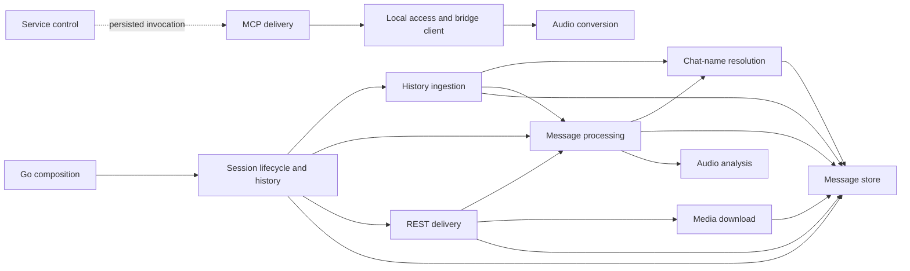

# Architecture: whatsapp-mcp

**Status:** STD-028 v1.37 zero-debt candidate

whatsapp-mcp joins a Go WhatsApp bridge to a Python MCP delivery surface. It
owns versioned source and service declarations; it does not own the operator's
WhatsApp account, authenticated device session, local message stores, media,
or currently running processes.

The machine-readable ownership and dependency contract in
[`appcheck.toml`](../../appcheck.toml) is normative.

## Dependency direction



Arrows point from consumer to provider, matching `may_depend_on`. The Python
delivery root depends inward on local access functions, which depend on audio
conversion. The Go composition root delegates connection lifecycle; history
ingestion, chat-name resolution, messaging, REST, media, persistence, and audio
analysis each have one file-level owner. Service declarations invoke the Python
delivery root but contain no product behavior.

The Go capabilities remain one package because they share existing unexported
helpers and lifecycle state. Appcheck's Go import analysis cannot observe
same-package file-to-file calls, so a non-live source-level symbol ratchet
verifies that every observed capability call is allowed by `may_depend_on` and
that the declared Go graph is acyclic. The same suite enforces exact file
ownership, persistence encapsulation, and the per-owner size cap.

## Physical layout

```text
whatsapp-bridge/
├── main.go                  # thin Go composition root
├── bridge/
│   ├── bridge.go            # connection lifecycle and event composition
│   ├── history.go           # history ingestion
│   ├── naming.go            # chat-name resolution
│   ├── store.go             # SQLite message persistence
│   ├── messaging.go         # message send, receive, and media metadata
│   ├── media.go             # media download implementation
│   ├── rest.go              # local REST request and response surface
│   ├── audio_analysis.go    # pure Ogg/Opus and waveform helpers
│   └── pure_helpers_test.go # non-live Go behavior characterization
├── go.mod
└── go.sum

whatsapp-mcp-server/
├── main.py                  # thin FastMCP transport composition root
├── tools.py                 # MCP instance and tool registration
├── whatsapp.py              # local store and bridge access
├── audio.py                 # ffmpeg conversion boundary
├── pyproject.toml
└── uv.lock

infra/launchd/               # persisted service declaration
tests/architecture/          # non-live contract tests
docs/architecture/           # ownership and adoption evidence
```

The two runtime roots remain separate because they have different languages,
processes, and responsibilities. The four direct Python source files are
established capabilities beside four build/control files, not an
undifferentiated script pile. The configured eight-file root cap describes that
intentional surface exactly; creating one-file folders would add navigation
without clearer ownership.

## Named owner map

The human names below match the exact machine-owner names in
`appcheck.toml`:

| Machine owner | Responsibility |
|---|---|
| `bridge_composition` | Thin Go process composition |
| `bridge_session` | Client connection lifecycle and event composition |
| `bridge_history` | History-sync ingestion |
| `bridge_naming` | Persisted, group, and contact chat-name resolution |
| `bridge_store` | SQLite message and media-metadata persistence |
| `bridge_messaging` | Message send, receive, and metadata extraction |
| `bridge_media` | Media download and direct-path handling |
| `bridge_rest` | Local REST request and response delivery |
| `bridge_audio_analysis` | Pure Ogg/Opus analysis and waveform generation |
| `bridge_test_consumers` | Non-live Go behavior characterization |
| `bridge_build` | Go module and dependency lock |
| `server_audio` | Audio conversion boundary |
| `server_access` | Local store access and bridge client |
| `server_delivery` | FastMCP tool registration and thin transport selection |
| `server_build` | Nested Python environment and dependency lock |
| `test_consumers` | Checkout-local architecture-contract regressions |
| `service_control` | Persisted LaunchAgent and automation declaration |
| `project_knowledge` | Architecture and adoption documentation |
| `agent_control` | Repository-local coding-agent placement rules |
| `build_control` | Root metadata, baseline, hook, and native gate |

## Live and private-data boundary

Routine architecture proof must not start the Go bridge or Python MCP server,
connect or reconnect WhatsApp, display a QR code, inspect the message stores,
send messages or media, download media, or read private runtime logs.

The protected primary paths include:

- `whatsapp-bridge/store/`;
- the built `whatsapp-bridge/whatsapp-bridge` binary;
- local virtual environments and caches; and
- all live service processes and authenticated session state.

`make check` is deliberately non-live: it compiles Python source without
importing it, compiles the Go package through `go test`, runs the pure
architecture contract tests, and invokes checkout-local Appcheck. Green
source checks are not live WhatsApp acceptance.

## Zero-debt ratchet

The former 1,351-line Go implementation owner is now divided at its existing
capability seams. `main.go` remains the thin composition root for the documented
`go run main.go` invocation, while no Go capability owner exceeds 500 lines.
All SQLite schema knowledge is contained by `bridge_store`, and the declared
same-package graph is acyclic. The former 247-line Python root imports the
registered MCP instance from `tools.py`; `main.py` contains only transport
selection and invocation.

`.appcheck/architecture-baseline.json` is empty. Do not add
composition-size, invalid-configuration, flat-root, ownership, dependency, or
cycle exceptions. Further decomposition should follow independently changing
capabilities and focused non-live behavior evidence, not a folder-depth quota.

## Enforcement

`make architecture-check` runs checkout-local Appcheck. `make check` includes
the focused contract test and the zero-debt architecture ratchet alongside
the existing Python and Go compilation checks.

When a boundary changes, update this document and `appcheck.toml`, add a
failing non-live test first, and run the focused architecture, native,
generated-hook, and package/build proof appropriate to the changed component.
